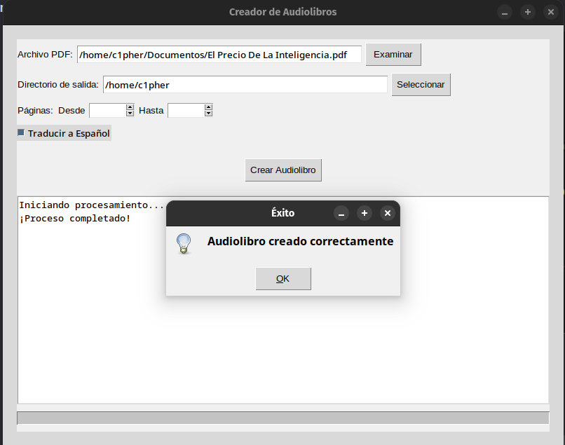
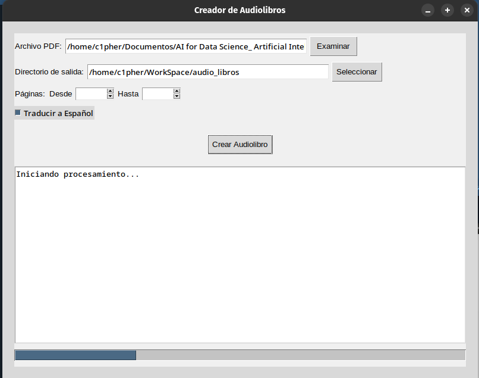
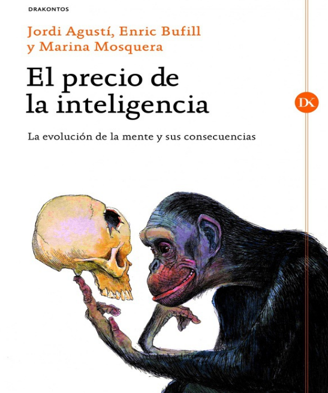

```markdown
# Generador de Audiolibros con Traducción Automática


## Descripción
Este proyecto convierte archivos PDF en audiolibros en español, permitiendo:
- Seleccionar rangos específicos de páginas
- Traducir automáticamente el texto a español
- Generar un archivo de audio continuo (MP3)
- Monitorear el progreso con una barra de estado

Utiliza tecnologías como:
- **Edge TTS**: Conversión de texto a voz con voces neuronales
- **pdfplumber**: Extracción precisa de texto de PDFs
- **Google Translate API**: Traducción automática
- **FFmpeg**: Unión de fragmentos de audio

## Características Principales
✅ **Nueva Arquitectura de Procesamiento**
- División del texto en *chunks* para:
  - Evitar limitaciones de la API de Google Translate
  - Mejorar la estabilidad en traducciones largas
  - Permitir pausas entre fragmentos de audio

✅ **Sistema de Progreso en Tiempo Real**
- Barra de progreso que muestra:
  - Extracción de texto (10%)
  - Traducción (20%)
  - Generación de audio (70%)
  - Post-procesamiento (95-100%)

✅ **Manejo de Errores Mejorado**
- Validación automática de:
  - Rutas de archivos válidas
  - Rangos de páginas coherentes
  - Conectividad con servicios externos

✅ **Automatización Completa**
- Limpieza automática de archivos temporales
- Organización de archivos en directorios específicos
- Notificaciones al finalizar el proceso

## Capturas de Pantalla
### Interfaz Principal

*Ventana principal con campos para seleccionar PDF y configurar opciones*

### Selección de Páginas

*Configuración de páginas inicial y final para procesamiento parcial*

### Progreso de Traducción

*Barra de progreso mostrando la traducción y generación de audio*

### Resultado Final

*Archivo de audio generado y mensajes de confirmación*


## Requisitos
- Python 3.8+
- FFmpeg instalado en el sistema
- Dependencias de Python:
  ```bash
  pip install pdfplumber edge-tts googletrans==4.0.0-rc1
  ```

## Instalación
1. Clona el repositorio:
   ```bash
   git clone https://github.com/tu-usuario/audiolibros.git
   ```
2. Instala FFmpeg:
   - Windows: [Descargar desde ffmpeg.org](https://ffmpeg.org/download.html)
   - Linux: `sudo apt install ffmpeg`
   - macOS: `brew install ffmpeg`

## Uso
1. Ejecuta la aplicación:
   ```bash
   python gui-audio.py
   ```
2. En la interfaz gráfica:
   - Selecciona el archivo PDF
   - Elige el directorio de salida
   - Configura el rango de páginas (opcional)
   - Activa la traducción si es necesario
   - Presiona "Crear Audiolibro"

## Notas Importantes
⚠️ **Limitaciones Conocidas**
- La traducción puede demorar debido a:
  - Limitaciones de la API gratuita de Google
  - Tamaño de los fragmentos (*chunks*)
- Los PDFs con formato complejo (imágenes/tablas) pueden extraer texto incompleto

## Solución de Problemas
| Error                | Solución                                  |
|----------------------|------------------------------------------|
| `FFmpeg not found`   | Verifica la instalación de FFmpeg         |
| Traducciones lentas  | Reduce el tamaño del PDF o el rango de páginas |
| Texto no extraído    | Asegúrate de usar PDFs con texto editable |

## Contribución
Se aceptan mejoras en:
- Sistema de caché para traducciones
- Detección automática de idioma original
- Soporte para más voces de TTS
- Interfaz más intuitiva

## Créditos
- Iconos: [Flaticon](https://www.flaticon.com)
- Documentación: [Edge TTS](https://github.com/rany2/edge-tts)

## Licencia
MIT License - Ver archivo [LICENSE](LICENSE) para más detalles
```
